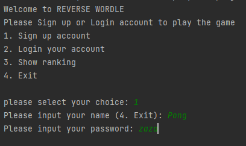
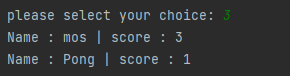
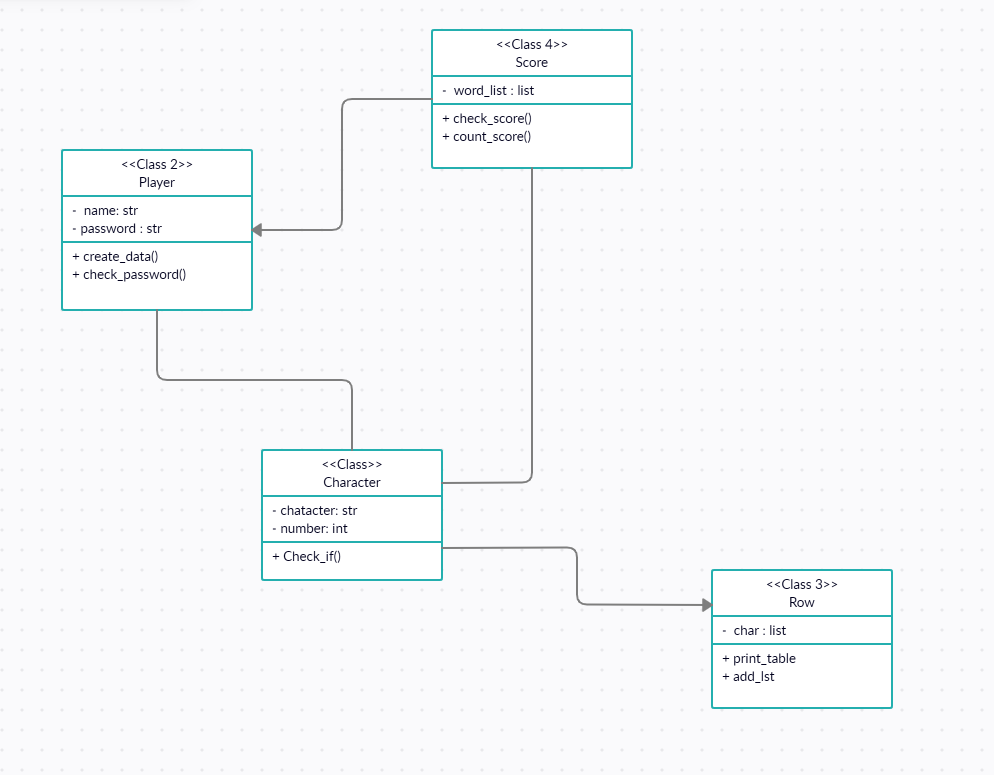

# REVERSE WORDLE

This one is a project for Computer Programming 1, I got inspired by WORDLE.

### Project Overview

This project called ***REVERSE WORDLE***, It's name look familiar with WORDLE but this game is harder than you think.
To play, You need to sign up or login.

### How to use and play?
1. Create a user or login user to play.
2. Login user to play for each game.
3. When the game start
   * If you guess a letter that's not in the word, it's grayed out, you can't use it again.
   * If you guess a letter that is in the word, it turns yellow you must include it. 
   * If you guess a letter in the exact position, it turns red and is locked in place.
4. Guesses as much as you can. The more guesser, The winner
5. After finished, user can see scoreboard.

### Program's Requirement
* [json](https://docs.python.org/3/library/json.html?highlight=json#module-json): Used for Storing User's Data
* [random](https://docs.python.org/3/library/random.html): Used for Gameplay

### Program Design
There are **4** classes in this Program.
* **Character**: This class is used for check every single character in word that user input then return in from of color, also make a list to contain it.
* **Player**: This class is used for create a json file for user to store a username, password, and score.
* **Row**: This class is used for create Row and display it.
* **Score**: This class is used for calculate score which user get then store it in PLayer class.

### Code Structure
* [main_prog.py](main_prog.py): Run Main Program.
* [character_word.py](character_word.py): Check character.
* [player_data.py](player_data.py): Create a Player data to store.
* [Score.py](score.py): Contains score.
* [Row.py](row.py): Contains Row for print.

